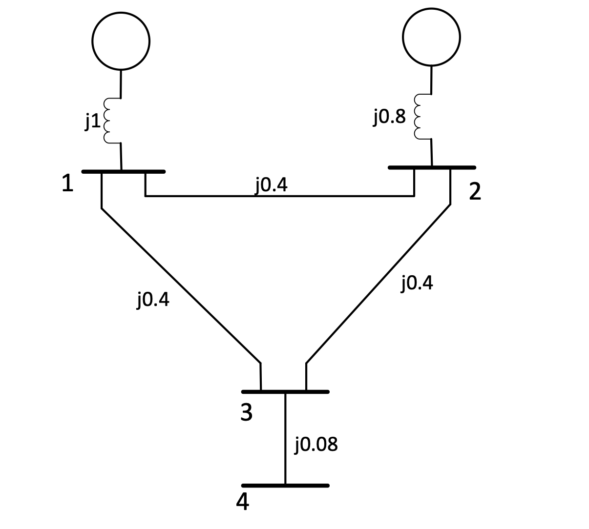
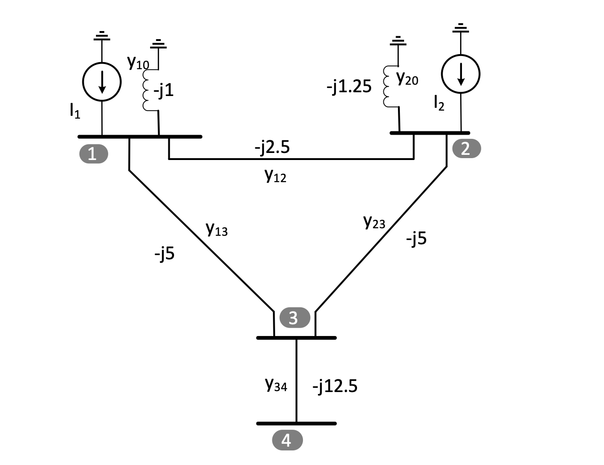

<h2>Introduction</h2>

The Y-Bus matrix is a key component in load flow analysis, providing a mathematical representation of the power system network. It is a sparse symmetric matrix that characterizes the admittance (or inverse of impedance) between all pairs of connected buses in a power system. By forming the Y-Bus matrix, we can efficiently solve load flow equations to determine the steady-state operating conditions of the power system network. The load flow studies are the backbone of the power system analysis and design. They are necessary for the planning, operation, economic dispatch, and exchange of power between utilities.. 

### Y Bus Matrix Formation

To obtain Y-Bus matrix for the interconnected power system, consider a simple network shown in Figure 1. The impedances of the lines are expressed in per unit on a common MVA base. The resistances of the interconnected lines are neglected for the simplicity. For the analysis node-voltage equations need to be considered which is based on Kirchoff’s current law. So that the impedances of the interconnected lines need to be converted to admittances as per the formula given below – 
 

  yij = 1/zij = 1/(rij + xij)  ..........(1)
 
 

 

<b>Fig 1: Impedance diagram of 4-bus interconnected power system network.</b>
 

 

 

<b>Fig 2: Admittance diagram for 4-bus interconnected power system network.</b>
 

The admittance diagram for the 4-bus interconnected power system is shown in Figure 2, where node 0 is taken as the reference (normally ground). Applying KCL to the all buses (nodes), the node-voltage equations are given below –  

 

  I1 = y10V1 + y12(V1 - V2) + y13(V1 - V3)  ...........(2)
 
 

 

  I2 = y20V2 + y12(V2 - V1) + y23(V2 - V3)  ...........(3)
 
 

 

  0 = y23(V3 - V2) + y13(V3 - V1) + y34(V3 - V4)  ...........(4)
 
 

 

  0 = y34(V4 - V3) ...........(5)

 
 

Rearranging the terms – 

 

 
  I1 = (y10 + y12 + y13)V1 - y12V2 - y13V3 ...........(6)

 
 

 

 
  I2 = -y12V1 + (y20 + y12 + y23)V2 - y23V3 ..........(7)

 
 

 

 
  0 = -y13V1 - y23V2 + (y13 + y23 + y34)V3 - y34V4 ...........(8)

 
 

 

 
  0 = -y34V3 + y34V4 ...........(9)

 
 

Writing equations in the matrix form – 

  <strong>Matrix Equation:</strong> 
  

    <table border="1" style="border-collapse: collapse; margin: 0 auto;">
      <tr>
        <td>I1</td>
      </tr>
      <tr>
        <td>I2</td>
      </tr>
      <tr>
        <td>I3</td>
      </tr>
      <tr>
        <td>I4</td>
      </tr>
    </table>
  

  =
  

    <table border="1" style="border-collapse: collapse; margin: 0 auto;">
      <tr>
        <td>Y11</td>
        <td>Y12</td>
        <td>Y13</td>
        <td>Y14</td>
      </tr>
      <tr>
        <td>Y21</td>
        <td>Y22</td>
        <td>Y23</td>
        <td>Y24</td>
      </tr>
      <tr>
        <td>Y31</td>
        <td>Y32</td>
        <td>Y33</td>
        <td>Y34</td>
      </tr>
      <tr>
        <td>Y41</td>
        <td>Y42</td>
        <td>Y43</td>
        <td>Y44</td>
      </tr>
    </table>
  

  

    <table border="1" style="border-collapse: collapse; margin: 0 auto;">
      <tr>
        <td>V1</td>
      </tr>
      <tr>
        <td>V2</td>
      </tr>
      <tr>
        <td>V3</td>
      </tr>
      <tr>
        <td>V4</td>
      </tr>
    </table>
  

Then – 

<ul>
  Y11 = (y10 + y12 + y13)

  Y22 = (y20 + y12 + y23)

  Y33 = (y13 + y23 + y34)

  Y44 = y34

  Y12 = Y21 = -y12

  Y13 = Y31 = -y13

  Y23 = Y32 = -y23

  Y34 = Y43 = -y34
</ul>

In this network, there is no interconnection for the bus 4 with the bus 1 and 2. Due to this-

<ul>
  Y14 = Y41 = 0
  
  
  Y24 = Y42 = 0
</ul>

Generalized Y-bus node-voltage equations for the n-bus interconnected power system network is given below – 

  

    <table border="1" style="border-collapse: collapse; margin: 0 auto;">
      <tr><td>I1</td></tr>
      <tr><td>I2</td></tr>
      <tr><td>...</td></tr>
      <tr><td>Ii</td></tr>
      <tr><td>...</td></tr>
      <tr><td>In</td></tr>
    </table>
  

  =
  

    <table border="1" style="border-collapse: collapse; margin: 0 auto;">
      <tr>
        <td>Y11</td>
        <td>Y12</td>
        <td>...</td>
        <td>Y1i</td>
        <td>...</td>
        <td>Y1n</td>
      </tr>
      <tr>
        <td>Y21</td>
        <td>Y22</td>
        <td>...</td>
        <td>Y2i</td>
        <td>...</td>
        <td>Y2n</td>
      </tr>
      <tr>
        <td>...</td>
        <td>...</td>
        <td>...</td>
        <td>...</td>
        <td>...</td>
        <td>...</td>
      </tr>
      <tr>
        <td>Y3i</td>
        <td>Y32</td>
        <td>...</td>
        <td>Y3i</td>
        <td>...</td>
        <td>Y3n</td>
      </tr>
      <tr>
        <td>...</td>
        <td>...</td>
        <td>...</td>
        <td>...</td>
        <td>...</td>
        <td>...</td>
      </tr>
      <tr>
        <td>Y4i</td>
        <td>Y42</td>
        <td>...</td>
        <td>Y4i</td>
        <td>...</td>
        <td>Y4n</td>
      </tr>
    </table>
  

  

    <table border="1" style="border-collapse: collapse; margin: 0 auto;">
      <tr><td>V1</td></tr>
      <tr><td>V2</td></tr>
      <tr><td>...</td></tr>
      <tr><td>Vi</td></tr>
      <tr><td>...</td></tr>
      <tr><td>Vn</td></tr>
    </table>
  

<ul>
  Ibus = Ybus.Vbus
</ul>

Where, Ibus is the vector of the injected bus currents and Vbus  is the vector of bus voltages measured from the reference node. Ybus  is known as the bus admittance matrix.

With the above explanation, it can be observed that the – 

•	The diagonal element of each node is the sum of admittances connected to it. It is known as self-admittance or driving point admittance. It can be calculated as – 

  
    Yii = 
    
      n
      &sum;
      i,j=0
    
    yij
  
  &nbsp;&nbsp; (j &ne; i)

•	The diagonal element of each node is the sum of admittances connected to it. It is known as self-admittance or driving point admittance. It can be calculated as – 

Yij = Yji = -yij 

The Y-bus matrix is symmetric along the leading diagonal, due to this only upper triangular nodal admittance matrix is required and it will improve the computational performance. Also, the Y-bus matrix is sparse matrix due to the interconnection of each bus with only a few nearby buses.